# Design Document

## Overview

This design document outlines the architecture and implementation approach for completing the Sci-Necromancer academic submission generation system. The design focuses on modular architecture, extensibility, and robust error handling while maintaining the existing React/TypeScript foundation.

## Architecture

### High-Level Architecture


### ISMRM Workflow Architecture (Part A - Digesting)

```mermaid
flowchart TD
    A1[txt/pdf/word Upload or Text Input] --> A2[LLM Analysis → Suggest Abstract Type]
    A2 --> A2_LOADING["🧠 Sourcing Impact & Synopsis and analyze contents Categories & keywords..."]
    A2_LOADING --> A3[Extract Sections: Impact / Synopsis / Categories & Keywords]
    A3 --> A3_POPUP[Interactive Category & Keywords Selection Popup]
    A3_POPUP --> A4[ISMRM/Clinical/ISRMT Spec Routing via Guideline Router]
    A4 --> A4_SUGGEST[Abstract Type Suggestion Popup]
    A4_SUGGEST --> A5[Output Structured Abstract JSON]
    A5 --> A6[Generate Summary or Extended Abstract]
    
    style A2_LOADING fill:#e1f5fe
    style A3_POPUP fill:#fff3e0
    style A4_SUGGEST fill:#f3e5f5
```



### Core Design Principles

1. **Provider Pattern**: Abstract AI providers to allow easy switching between Google AI and OpenAI
2. **Service Layer**: Centralized business logic with clear separation of concerns
3. **Error Boundaries**: Graceful error handling at component and service levels
4. **Progressive Enhancement**: Core functionality works offline, enhanced features require network
5. **Modular Templates**: Conference-specific logic isolated in separate modules

## Components and Interfaces

### Interactive UI Components

```typescript
interface CategorySelectionPopup {
  categories: CategoryResult[];
  keywords: KeywordResult[];
  onCategorySelect: (categories: CategoryResult[]) => void;
  onKeywordSelect: (keywords: KeywordResult[]) => void;
  isVisible: boolean;
  onClose: () => void;
}

interface AbstractTypeSuggestionPopup {
  suggestions: AbstractTypeSuggestion[];
  onTypeSelect: (type: AbstractType) => void;
  isVisible: boolean;
  onClose: () => void;
}

interface LoadingProgress {
  currentStep: string;
  progress: number;
  emoji: string;
  message: string;
  isVisible: boolean;
}
```

**Loading Animation Steps:**
1. 🧠 "Analyzing content structure..."
2. 📊 "Extracting categories and keywords..."
3. 🎯 "Matching ISMRM guidelines..."
4. ✨ "Preparing recommendations..."

**Category Color Coding:**
- Main Category: `#ffff00` (Yellow)
- Sub Category: `#ffa500` (Orange)  
- Secondary Category: `#ffc0cb` (Pink)

### File Processing Service

```typescript
interface FileProcessor {
  supportedTypes: string[];
  parse(file: File): Promise<string>;
  validate(file: File): boolean;
}

interface FileProcessingService {
  registerProcessor(type: string, processor: FileProcessor): void;
  processFile(file: File): Promise<string>;
  getSupportedTypes(): string[];
}
```

**Implementation Strategy:**
- Use `pdf-parse` library for PDF text extraction
- Implement `mammoth.js` for DOCX parsing
- Create fallback mechanisms for unsupported formats
- Add file size and type validation

### OpenAI Provider Implementation

```typescript
interface LLMProvider {
  analyzeContent(text: string): Promise<AnalysisResult>;
  suggestAbstractType(text: string, categories: Category[], keywords: string[]): Promise<AbstractTypeSuggestion[]>;
  generateFinalAbstract(text: string, type: AbstractType, categories: Category[], keywords: string[]): Promise<AbstractData>;
  generateCreativeAbstract(coreIdea: string): Promise<AbstractData>;
  generateImage(imageState: ImageState, creativeContext: string): Promise<string>;
}
```

**OpenAI-Specific Implementation:**
- Use GPT-4 for text analysis and generation
- Implement DALL-E 3 for image generation
- Use GPT-4-vision for image analysis and editing
- Implement structured output using function calling
- Add retry logic and rate limiting

### Export Service Architecture

```typescript
interface ExportService {
  exportToPDF(data: AbstractData, template: ConferenceTemplate): Promise<Blob>;
  exportToDocx(data: AbstractData, template: ConferenceTemplate): Promise<Blob>;
  exportToJSON(data: AbstractData): Promise<Blob>;
}

interface ConferenceTemplate {
  name: string;
  wordLimits: {
    impact: number;
    synopsis: number;
  };
  formatting: {
    fontSize: number;
    fontFamily: string;
    margins: Margins;
  };
  structure: TemplateStructure;
}
```

**Export Implementation:**
- Use `jsPDF` for PDF generation with custom templates
- Implement `docx` library for Word document creation
- Create template system for different conference formats
- Add preview functionality before download

### ISMRM Guideline Router System

```typescript
interface ISMRMGuidelineRouter {
  loadGuidelines(): Promise<void>;
  classifyContent(text: string): Promise<ContentClassification>;
  suggestAbstractType(classification: ContentClassification): Promise<AbstractTypeSuggestion[]>;
  getSpecsGuideline(abstractType: AbstractType): Promise<SpecsGuideline>;
}

interface ContentClassification {
  categories: CategoryResult[];
  keywords: KeywordResult[];
  confidence: number;
}

interface CategoryResult {
  name: string;
  type: 'main' | 'sub' | 'secondary';
  probability: number;
  color: string; // #ffff00 for main, #ffa500 for sub, #ffc0cb for secondary
}

interface KeywordResult {
  keyword: string;
  relevance: number;
  frequency: number;
}

interface OccamContentClassifier {
  classifyContent(contentText: string, keywords: string[], categories: Category[]): Promise<ClassificationResult>;
  buildOccamPrompt(contentText: string, keywords: string[], categories: Category[]): string;
  parseSimpleResponse(response: string): ClassificationResult;
}

interface ClassificationResult {
  abstractTypes: {
    [key in AbstractType]: number; // probability
  };
  confidence: number;
}
```

**Guideline Files Structure:**
- `/lib/llm/prompts/guidelines/call-for-abstracts-global-guidance.md`
- `/lib/llm/prompts/guidelines/abstract-category-guidance.md`
- `/lib/llm/prompts/guidelines/ismrm-abstract-categories-keywords.md`
- `/lib/llm/prompts/specs/standard-abstract-specs.md`
- `/lib/llm/prompts/specs/clinical-practice-abstract-specs.md`
- `/lib/llm/prompts/specs/ismrt-abstract-specs.md`
- `/lib/llm/prompts/specs/registered-abstract-specs.md`

**Occam's Razor Classification Rules:**
- body/neuro/pediatrics/cardiovascular/intervention/msk/preclinical → Clinical Practice ≥75% AND Standard ≥25%
- Other categories → Standard ≥75% AND ISMRT ≥50%
- Contains hypothesis/mimic/simulation → Registered ≥90%
- Only include probabilities ≥30%

### Database Integration

```typescript
interface DatabaseService {
  saveAbstract(abstract: SavedAbstract): Promise<string>;
  loadAbstract(id: string): Promise<SavedAbstract>;
  listAbstracts(userId?: string): Promise<SavedAbstract[]>;
  deleteAbstract(id: string): Promise<void>;
  exportAllData(): Promise<Blob>; // Export all abstracts for backup
  importData(data: Blob): Promise<ImportResult>; // Import from backup file
}

interface SavedAbstract {
  id: string;
  title: string;
  conference: Conference;
  abstractData: AbstractData;
  originalText: string;
  generationParameters?: GenerationParameters; // Preserve settings used
  createdAt: Date;
  updatedAt: Date;
}

interface GenerationParameters {
  provider: 'google' | 'openai';
  model: string;
  categories?: CategoryResult[];
  keywords?: KeywordResult[];
  abstractType?: AbstractType;
}

interface ImportResult {
  success: boolean;
  imported: number;
  skipped: number;
  errors: string[];
}
```

**Storage Strategy:**
- Primary: localStorage for offline functionality and draft persistence
- Secondary: Supabase for cloud sync and backup
- Implement conflict resolution for offline/online sync
- Export/import functionality for data portability and backup
- Preserve generation parameters to enable re-editing with same settings

## Data Models

### Enhanced Type Definitions

```typescript
// Extended existing types
export interface ExtendedSettings extends Settings {
  openAIApiKey?: string;
  supabaseConfig?: {
    url: string;
    key: string;
  };
  exportPreferences: {
    defaultFormat: 'pdf' | 'docx' | 'json';
    includeMetadata: boolean;
  };
}

export interface ProcessingState {
  isProcessing: boolean;
  currentStep: string;
  progress: number;
  emoji: string;
  error?: string;
}

export interface ExportOptions {
  format: 'pdf' | 'docx' | 'json';
  template: ConferenceTemplate;
  includeImages: boolean;
  customFormatting?: Partial<ConferenceTemplate>;
}

export interface WritingStyleConfig {
  balanceFormalConversational: boolean;
  clearSubjects: boolean;
  shortSentences: boolean;
  rhythmControl: boolean;
  faithfulnessToOriginal: boolean;
  styleConsistency: boolean;
  naturalExpression: boolean;
  logicalRigor: boolean;
  eliminateAITone: boolean;
  avoidAIColloquialisms: string[]; // ["It is worth noting", "It is not difficult to find", "Based on the above analysis"]
}

export interface AbstractGenerationPrompt {
  basePrompt: string;
  guidelineContent: string;
  writingStyle: WritingStyleConfig;
  specsGuideline: string;
}
```

### Error Handling Models

```typescript
export interface AppError {
  code: string;
  message: string;
  details?: any;
  recoverable: boolean;
  timestamp: Date;
}

export interface ErrorBoundaryState {
  hasError: boolean;
  error?: AppError;
  errorInfo?: any;
}
```

## Error Handling

### Error Classification and Recovery

1. **Network Errors**: Retry with exponential backoff, offline mode fallback
2. **API Errors**: Provider switching, graceful degradation
3. **File Processing Errors**: Format conversion, manual input fallback
4. **Validation Errors**: User feedback, correction suggestions

### Error Boundary Implementation

```typescript
class ServiceErrorBoundary extends React.Component<Props, ErrorBoundaryState> {
  // Catch service-level errors
  // Provide recovery options
  // Log errors for debugging
}

class ComponentErrorBoundary extends React.Component<Props, ErrorBoundaryState> {
  // Catch UI-level errors
  // Maintain app functionality
  // Show user-friendly messages
}
```

## Testing Strategy

### Unit Testing Approach

1. **Service Layer Tests**
   - Mock external API calls
   - Test error handling scenarios
   - Validate data transformations

2. **Component Tests**
   - Test user interactions
   - Verify state management
   - Check accessibility compliance

3. **Integration Tests**
   - End-to-end workflow testing
   - API integration validation
   - File processing pipelines

### Test Structure

```
__tests__/
├── services/
│   ├── fileProcessing.test.ts
│   ├── llmService.test.ts
│   ├── exportService.test.ts
│   └── databaseService.test.ts
├── components/
│   ├── ConferencePanel.test.tsx
│   ├── ExportButtons.test.tsx
│   └── ModelManager.test.tsx
├── integration/
│   ├── abstractGeneration.test.ts
│   ├── fileUpload.test.ts
│   └── exportWorkflow.test.ts
└── e2e/
    ├── completeWorkflow.test.ts
    └── errorRecovery.test.ts
```

### Testing Tools and Configuration

- **Jest**: Unit and integration testing framework
- **React Testing Library**: Component testing utilities
- **MSW (Mock Service Worker)**: API mocking for tests
- **Playwright**: End-to-end testing for critical workflows

## Implementation Phases

### Phase 1: Core Infrastructure
1. File processing service implementation
2. OpenAI provider completion
3. Error handling framework
4. Basic export functionality

### Phase 2: Enhanced Features
1. Database integration
2. Conference template system
3. Advanced export options
4. UI/UX improvements

### Phase 3: Testing and Polish
1. Comprehensive test suite
2. Performance optimization
3. Accessibility compliance
4. Documentation completion

## Security Considerations

1. **API Key Management**: Secure storage, environment-based configuration
2. **File Upload Security**: Type validation, size limits, content scanning
3. **Data Privacy**: Local-first approach, optional cloud sync
4. **Error Logging**: Sanitize sensitive information before logging

## Performance Optimization

1. **Lazy Loading**: Conference templates and providers loaded on demand
2. **Caching**: LLM responses cached locally for repeated operations
3. **Debouncing**: User input processing with appropriate delays
4. **Progressive Loading**: Large file processing with progress indicators

## Accessibility Features

1. **Keyboard Navigation**: Full keyboard support for all interactions
2. **Screen Reader Support**: Proper ARIA labels and semantic HTML
3. **High Contrast Mode**: Alternative color schemes for visibility
4. **Focus Management**: Clear focus indicators and logical tab order
5. **Error Announcements**: Screen reader accessible error messages

### Guideline Management System

```typescript
interface GuidelineManager {
  loadGlobalGuidance(): Promise<string>;
  loadCategoryGuidance(): Promise<string>;
  loadRoutingRules(): Promise<RoutingRule[]>;
  loadSpecsGuideline(abstractType: AbstractType): Promise<string>;
}

interface RoutingRule {
  categories: string[];
  conditions: string[];
  abstractType: AbstractType;
  minProbability: number;
}
```

**Guideline File Locations:**
- Global guidance: `/lib/llm/prompts/guidelines/call-for-abstracts-global-guidance.md`
- Category guidance: `/lib/llm/prompts/guidelines/abstract-category-guidance.md`
- Routing rules: `/lib/llm/prompts/guidelines/ismrm-abstract-categories-keywords.md`
- Specs guidelines: `/lib/llm/prompts/specs/{abstract-type}-specs.md`

### Writing Style Enhancement

The abstract generation process incorporates advanced writing style requirements:

**Core Principles:**
1. **Balance**: Formal academic writing with conversational expression
2. **Clarity**: Clear subjects in every sentence, short sentences preferred
3. **Rhythm**: Natural fluctuations, avoid flat narrative
4. **Faithfulness**: Preserve core information and key data
5. **Consistency**: Align with theme, purpose, and target audience
6. **Natural Expression**: Avoid excessive embellishment
7. **Logical Structure**: Maintain original logical flow
8. **Human-like**: Eliminate AI-generated tone and colloquialisms

**Prohibited AI Phrases:**
- "It is worth noting"
- "It is not difficult to find"
- "Based on the above analysis"
- Other machine-generated artifacts

### Interactive Workflow Implementation

**Step A2 → A3: Content Analysis with Loading Animation**
```typescript
interface AnalysisWorkflow {
  startAnalysis(text: string): Promise<void>;
  showLoadingProgress(): void;
  displayCategoryPopup(results: ContentClassification): void;
  handleUserSelection(selectedCategories: CategoryResult[], selectedKeywords: KeywordResult[]): void;
}
```

**Step A3 → A4: Guideline Routing**
```typescript
interface GuidelineRouter {
  routeToSpecs(categories: CategoryResult[], keywords: KeywordResult[]): Promise<AbstractType[]>;
  applyOccamClassification(content: string, categories: string[], keywords: string[]): Promise<ClassificationResult>;
  showAbstractTypeSuggestions(suggestions: AbstractTypeSuggestion[]): void;
}
```

**Step A4 → A5: Abstract Generation**
```typescript
interface AbstractGenerator {
  generateAbstract(
    originalText: string,
    selectedType: AbstractType,
    categories: CategoryResult[],
    keywords: KeywordResult[]
  ): Promise<AbstractData>;
  applyWritingStyle(content: string, style: WritingStyleConfig): Promise<string>;
  validateAgainstSpecs(abstract: AbstractData, specs: string): Promise<ValidationResult>;
}
```