# Design Document

## Overview

This design document outlines the architecture and implementation approach for completing the Sci-Necromancer academic submission generation system. The design focuses on modular architecture, extensibility, and robust error handling while maintaining the existing React/TypeScript foundation.

## Architecture

### High-Level Architecture


### ISMRM Workflow Architecture (Part A - Digesting)

```mermaid
flowchart TD
    A1[txt/pdf/word Upload or Text Input] --> A2[LLM Analysis → Suggest Abstract Type]
    A2 --> A2_LOADING["🧠 Sourcing Impact & Synopsis and analyze contents Categories & keywords..."]
    A2_LOADING --> A3[Extract Sections: Impact / Synopsis / Categories & Keywords]
    A3 --> A3_POPUP[Interactive Category & Keywords Selection Popup]
    A3_POPUP --> A4[ISMRM/Clinical/ISRMT Spec Routing via Guideline Router]
    A4 --> A4_SUGGEST[Abstract Type Suggestion Popup]
    A4_SUGGEST --> A5[Output Structured Abstract JSON]
    A5 --> A6[Generate Summary or Extended Abstract]
    
    style A2_LOADING fill:#e1f5fe
    style A3_POPUP fill:#fff3e0
    style A4_SUGGEST fill:#f3e5f5
```



### Core Design Principles

1. **Provider Pattern**: Abstract AI providers to allow easy switching between Google AI and OpenAI
2. **Service Layer**: Centralized business logic with clear separation of concerns
3. **Error Boundaries**: Graceful error handling at component and service levels
4. **Progressive Enhancement**: Core functionality works offline, enhanced features require network
5. **Modular Templates**: Conference-specific logic isolated in separate modules

## Components and Interfaces

### Interactive UI Components

```typescript
interface CategorySelectionPopup {
  categories: CategoryResult[];
  keywords: KeywordResult[];
  onCategorySelect: (categories: CategoryResult[]) => void;
  onKeywordSelect: (keywords: KeywordResult[]) => void;
  isVisible: boolean;
  onClose: () => void;
}

interface AbstractTypeSuggestionPopup {
  suggestions: AbstractTypeSuggestion[];
  onTypeSelect: (type: AbstractType) => void;
  isVisible: boolean;
  onClose: () => void;
}

interface LoadingProgress {
  currentStep: string;
  progress: number;
  emoji: string;
  message: string;
  isVisible: boolean;
}

interface TooltipSystem {
  content: string;
  position: 'top' | 'bottom' | 'left' | 'right';
  trigger: 'hover' | 'focus' | 'click';
  delay?: number;
  maxWidth?: number;
}

interface HelpContext {
  feature: string;
  description: string;
  examples?: string[];
  relatedLinks?: string[];
}
```

**Loading Animation Steps:**
1. 🧠 "Analyzing content structure..."
2. 📊 "Extracting categories and keywords..."
3. 🎯 "Matching ISMRM guidelines..."
4. ✨ "Preparing recommendations..."

**Category Color Coding:**
- Main Category: `#ffff00` (Yellow)
- Sub Category: `#ffa500` (Orange)  
- Secondary Category: `#ffc0cb` (Pink)

**Tooltip and Help System:**
- Contextual tooltips on all interactive elements
- Help icons (?) next to complex features
- Inline help text for form fields
- Guided tour for first-time users
- Searchable help documentation

### File Processing Service

```typescript
interface FileProcessor {
  supportedTypes: string[];
  parse(file: File): Promise<string>;
  validate(file: File): boolean;
}

interface FileProcessingService {
  registerProcessor(type: string, processor: FileProcessor): void;
  processFile(file: File): Promise<string>;
  getSupportedTypes(): string[];
  validateFile(file: File): ValidationResult;
}

interface ValidationResult {
  isValid: boolean;
  error?: FileValidationError;
}

interface FileValidationError {
  code: 'INVALID_TYPE' | 'FILE_TOO_LARGE' | 'FILE_CORRUPTED' | 'FILE_ENCRYPTED';
  message: string;
  suggestedAction: string;
}
```

**Implementation Strategy:**
- Use `pdf-parse` library for PDF text extraction
- Implement `mammoth.js` for DOCX parsing
- Create fallback mechanisms for unsupported formats
- Add file size validation with 10MB maximum limit (Requirement 1.4)
- Implement file type validation before parsing (Requirement 1.5)
- Provide specific error messages for different failure scenarios (Requirement 1.3)
- Suggest manual text input as alternative when parsing fails (Requirement 5.3)

**Validation Rules:**
- Maximum file size: 10MB
- Supported types: `.pdf`, `.docx`, `.doc`
- Pre-validation checks before attempting to parse
- Clear error messages with recovery suggestions

### OpenAI Provider Implementation

```typescript
interface LLMProvider {
  analyzeContent(text: string): Promise<AnalysisResult>;
  suggestAbstractType(text: string, categories: Category[], keywords: string[]): Promise<AbstractTypeSuggestion[]>;
  generateFinalAbstract(text: string, type: AbstractType, categories: Category[], keywords: string[]): Promise<AbstractData>;
  generateCreativeAbstract(coreIdea: string): Promise<AbstractData>;
  generateImage(imageState: ImageState, creativeContext: string): Promise<string>;
  validateApiKey(apiKey: string): Promise<boolean>;
}

interface ProviderConfig {
  apiKey: string;
  model: string;
  maxRetries: number;
  timeout: number;
}
```

**OpenAI-Specific Implementation:**
- Use GPT-4 for text analysis and generation (Requirement 2.2)
- Implement DALL-E 3 for image generation (Requirement 2.2)
- Use GPT-4-vision for image analysis and editing (Requirement 2.2)
- Implement structured output using function calling for consistent responses (Requirement 2.1)
- Add retry logic and rate limiting (Requirement 5.2)
- Handle API key configuration securely (Requirement 2.4)
- Provide meaningful error messages for API failures (Requirement 2.5)
- Maintain feature parity with Google AI provider (Requirement 2.3)

**Design Rationale:**
The OpenAI provider implementation mirrors the Google AI provider interface to ensure seamless switching between providers. This abstraction allows users to choose their preferred AI service without losing functionality. The structured output approach using function calling ensures consistent response formats across different models and providers.

### Export Service Architecture

```typescript
interface ExportService {
  exportToPDF(data: AbstractData, template: ConferenceTemplate): Promise<Blob>;
  exportToDocx(data: AbstractData, template: ConferenceTemplate): Promise<Blob>;
  exportToJSON(data: AbstractData): Promise<Blob>;
  previewExport(data: AbstractData, template: ConferenceTemplate): Promise<string>;
  validateExport(data: AbstractData, template: ConferenceTemplate): ValidationResult;
}

interface ConferenceTemplate {
  name: string;
  conference: 'ISMRM' | 'RSNA' | 'JACC';
  wordLimits: {
    impact: number;
    synopsis: number;
    abstract?: number;
  };
  formatting: {
    fontSize: number;
    fontFamily: string;
    margins: Margins;
    lineSpacing: number;
  };
  structure: TemplateStructure;
  validationRules: ValidationRule[];
}

interface ValidationRule {
  field: string;
  maxWords: number;
  required: boolean;
  customValidator?: (value: string) => boolean;
}
```

**Export Implementation:**
- Use `jsPDF` for PDF generation with custom templates (Requirement 3.1)
- Implement `docx` library for Word document creation (Requirement 3.2)
- Create template system for different conference formats (Requirement 3.5)
- Add preview functionality before download
- Include all abstract components in exports (Requirement 3.4)
- Support customization based on conference requirements (Requirement 3.5)
- Provide JSON export for programmatic access (Requirement 3.3)

**Design Rationale:**
The export service uses a template-based approach to support multiple conference formats. Each template encapsulates the specific formatting requirements, word limits, and validation rules for a particular venue. This design allows easy addition of new conference templates without modifying core export logic. The validation system ensures abstracts meet conference requirements before export.

### ISMRM Guideline Router System

```typescript
interface ISMRMGuidelineRouter {
  loadGuidelines(): Promise<void>;
  classifyContent(text: string): Promise<ContentClassification>;
  suggestAbstractType(classification: ContentClassification): Promise<AbstractTypeSuggestion[]>;
  getSpecsGuideline(abstractType: AbstractType): Promise<SpecsGuideline>;
}

interface ContentClassification {
  categories: CategoryResult[];
  keywords: KeywordResult[];
  confidence: number;
}

interface CategoryResult {
  name: string;
  type: 'main' | 'sub' | 'secondary';
  probability: number;
  color: string; // #ffff00 for main, #ffa500 for sub, #ffc0cb for secondary
}

interface KeywordResult {
  keyword: string;
  relevance: number;
  frequency: number;
}

interface OccamContentClassifier {
  classifyContent(contentText: string, keywords: string[], categories: Category[]): Promise<ClassificationResult>;
  buildOccamPrompt(contentText: string, keywords: string[], categories: Category[]): string;
  parseSimpleResponse(response: string): ClassificationResult;
}

interface ClassificationResult {
  abstractTypes: {
    [key in AbstractType]: number; // probability
  };
  confidence: number;
}
```

**Guideline Files Structure:**
- `/lib/llm/prompts/guidelines/call-for-abstracts-global-guidance.md`
- `/lib/llm/prompts/guidelines/abstract-category-guidance.md`
- `/lib/llm/prompts/guidelines/ismrm-abstract-categories-keywords.md`
- `/lib/llm/prompts/specs/standard-abstract-specs.md`
- `/lib/llm/prompts/specs/clinical-practice-abstract-specs.md`
- `/lib/llm/prompts/specs/ismrt-abstract-specs.md`
- `/lib/llm/prompts/specs/registered-abstract-specs.md`

**Occam's Razor Classification Rules:**
- body/neuro/pediatrics/cardiovascular/intervention/msk/preclinical → Clinical Practice ≥75% AND Standard ≥25%
- Other categories → Standard ≥75% AND ISMRT ≥50%
- Contains hypothesis/mimic/simulation → Registered ≥90%
- Only include probabilities ≥30%

### Database Integration

```typescript
interface DatabaseService {
  saveAbstract(abstract: SavedAbstract): Promise<string>;
  loadAbstract(id: string): Promise<SavedAbstract>;
  listAbstracts(userId?: string): Promise<SavedAbstract[]>;
  deleteAbstract(id: string): Promise<void>;
  updateAbstract(id: string, updates: Partial<SavedAbstract>): Promise<void>;
  exportAllData(): Promise<Blob>; // Export all abstracts for backup
  importData(data: Blob): Promise<ImportResult>; // Import from backup file
  getSyncStatus(): Promise<SyncStatus>;
}

interface SavedAbstract {
  id: string;
  title: string;
  conference: Conference;
  abstractData: AbstractData;
  originalText: string;
  generationParameters?: GenerationParameters; // Preserve settings used
  createdAt: Date;
  updatedAt: Date;
  userId?: string;
  syncStatus?: 'local' | 'synced' | 'conflict';
}

interface GenerationParameters {
  provider: 'google' | 'openai';
  model: string;
  categories?: CategoryResult[];
  keywords?: KeywordResult[];
  abstractType?: AbstractType;
}

interface ImportResult {
  success: boolean;
  imported: number;
  skipped: number;
  errors: string[];
}

interface SyncStatus {
  isOnline: boolean;
  lastSync?: Date;
  pendingChanges: number;
  conflicts: number;
}
```

**Storage Strategy:**
- Primary: localStorage for offline functionality and draft persistence (Requirement 8.1)
- Secondary: Supabase for optional cloud sync and backup (Requirement 8.2)
- Implement conflict resolution for offline/online sync
- Export/import functionality for data portability and backup (Requirement 8.5)
- Preserve generation parameters to enable re-editing with same settings (Requirement 8.3)
- Support loading and editing previously saved abstracts (Requirement 8.4)

**Design Rationale:**
The dual-storage approach prioritizes offline functionality while providing optional cloud backup. localStorage ensures the system works without network connectivity, meeting the core requirement for offline text editing (Requirement 5.5). Supabase integration is optional, allowing users to choose whether to enable cloud sync. The generation parameters preservation allows users to understand how each abstract was created and potentially regenerate with different settings.

## Data Models

### Enhanced Type Definitions

```typescript
// Extended existing types
export interface ExtendedSettings extends Settings {
  openAIApiKey?: string;
  supabaseConfig?: {
    url: string;
    key: string;
  };
  exportPreferences: {
    defaultFormat: 'pdf' | 'docx' | 'json';
    includeMetadata: boolean;
  };
}

export interface ProcessingState {
  isProcessing: boolean;
  currentStep: string;
  progress: number;
  emoji: string;
  error?: string;
}

export interface ExportOptions {
  format: 'pdf' | 'docx' | 'json';
  template: ConferenceTemplate;
  includeImages: boolean;
  customFormatting?: Partial<ConferenceTemplate>;
}

export interface WritingStyleConfig {
  balanceFormalConversational: boolean;
  clearSubjects: boolean;
  shortSentences: boolean;
  rhythmControl: boolean;
  faithfulnessToOriginal: boolean;
  styleConsistency: boolean;
  naturalExpression: boolean;
  logicalRigor: boolean;
  eliminateAITone: boolean;
  avoidAIColloquialisms: string[]; // ["It is worth noting", "It is not difficult to find", "Based on the above analysis"]
}

export interface AbstractGenerationPrompt {
  basePrompt: string;
  guidelineContent: string;
  writingStyle: WritingStyleConfig;
  specsGuideline: string;
}
```

### Error Handling Models

```typescript
export interface AppError {
  code: string;
  message: string;
  details?: any;
  recoverable: boolean;
  timestamp: Date;
}

export interface ErrorBoundaryState {
  hasError: boolean;
  error?: AppError;
  errorInfo?: any;
}
```

## Error Handling

### Error Classification and Recovery

1. **Network Errors**: Retry with exponential backoff, offline mode fallback (Requirement 5.2, 5.5)
2. **API Errors**: Provider switching, graceful degradation, meaningful error messages (Requirement 2.5, 5.1)
3. **File Processing Errors**: Format conversion, manual input fallback, clear error messages (Requirement 1.3, 5.3)
4. **Validation Errors**: User feedback, correction suggestions (Requirement 5.1)

### Error Boundary Implementation

```typescript
class ServiceErrorBoundary extends React.Component<Props, ErrorBoundaryState> {
  // Catch service-level errors
  // Provide recovery options
  // Log errors for debugging while protecting privacy (Requirement 5.4)
  // Display user-friendly error messages (Requirement 5.1)
}

class ComponentErrorBoundary extends React.Component<Props, ErrorBoundaryState> {
  // Catch UI-level errors
  // Maintain app functionality
  // Show user-friendly messages (Requirement 5.1)
  // Allow continued work despite component failures (Requirement 5.5)
}
```

**Design Rationale:**
The error handling system uses a layered approach with error boundaries at both service and component levels. This ensures that failures in one part of the system don't cascade to other components. The retry mechanism with exponential backoff handles transient network issues gracefully. When file processing fails, the system automatically suggests manual text input as an alternative, ensuring users can always continue their work. Error logging is implemented with privacy protection, sanitizing any sensitive information before logging.

## Testing Strategy

### Unit Testing Approach

1. **Service Layer Tests**
   - Mock external API calls using MSW
   - Test error handling scenarios with various failure modes
   - Validate data transformations and schema compliance
   - Test retry logic and exponential backoff
   - Verify provider switching mechanisms

2. **Component Tests**
   - Test user interactions with React Testing Library
   - Verify state management and context updates
   - Check accessibility compliance (ARIA, keyboard navigation)
   - Test loading states and error boundaries
   - Validate form inputs and validation logic

3. **Integration Tests**
   - End-to-end workflow testing for complete user journeys
   - API integration validation with real-world scenarios
   - File processing pipelines with sample documents
   - Database operations (save, load, sync)
   - Export functionality with format validation

4. **Snapshot Tests**
   - UI component consistency across changes
   - Generated abstract structure validation
   - Export format verification

### Test Structure

```
__tests__/
├── services/
│   ├── fileProcessing.test.ts
│   ├── llmService.test.ts
│   ├── exportService.test.ts
│   ├── databaseService.test.ts
│   └── guidelineRouter.test.ts
├── components/
│   ├── ConferencePanel.test.tsx
│   ├── ExportButtons.test.tsx
│   ├── ModelManager.test.tsx
│   ├── CategorySelectionPopup.test.tsx
│   └── ErrorBoundary.test.tsx
├── integration/
│   ├── abstractGeneration.test.ts
│   ├── fileUpload.test.ts
│   ├── exportWorkflow.test.ts
│   ├── providerSwitching.test.ts
│   └── offlineSync.test.ts
├── e2e/
│   ├── completeWorkflow.test.ts
│   ├── errorRecovery.test.ts
│   ├── accessibility.test.ts
│   └── multiConference.test.ts
└── __snapshots__/
    └── [component snapshots]
```

### Testing Tools and Configuration

- **Jest**: Unit and integration testing framework with coverage reporting
- **React Testing Library**: Component testing utilities with accessibility queries
- **MSW (Mock Service Worker)**: API mocking for deterministic tests
- **Playwright**: End-to-end testing for critical workflows and accessibility
- **jest-axe**: Automated accessibility testing

### Coverage Requirements

- **Target**: Minimum 80% code coverage across all modules (Requirement 6.5)
- **Critical Paths**: 100% coverage for core workflows (abstract generation, file processing, export)
- **Service Layer**: 90%+ coverage for all service modules (Requirement 6.1)
- **Component Layer**: 80%+ coverage with focus on user interactions (Requirement 6.1)
- **Integration Tests**: Cover all major user journeys and error scenarios (Requirement 6.2)
- **End-to-End Tests**: Complete workflow validation (Requirement 6.3)
- **UI Consistency**: Snapshot tests for all components (Requirement 6.4)

### Coverage Reporting

```json
{
  "coverageThreshold": {
    "global": {
      "branches": 80,
      "functions": 80,
      "lines": 80,
      "statements": 80
    },
    "lib/llm/**/*.ts": {
      "branches": 90,
      "functions": 90,
      "lines": 90,
      "statements": 90
    },
    "services/**/*.ts": {
      "branches": 90,
      "functions": 90,
      "lines": 90,
      "statements": 90
    }
  }
}
```

**Testing Rationale:**
The 80% coverage target balances thoroughness with practicality, ensuring critical functionality is well-tested without requiring exhaustive tests for every edge case. Higher coverage requirements for service and LLM modules reflect their importance to core functionality. Integration and end-to-end tests validate that components work together correctly, catching issues that unit tests might miss. Snapshot tests ensure UI consistency across changes, preventing unintended visual regressions.

## Implementation Phases

### Phase 1: Core Infrastructure
1. File processing service implementation (Requirements 1.1-1.5)
2. OpenAI provider completion (Requirements 2.1-2.5)
3. Error handling framework (Requirements 5.1-5.5)
4. Basic export functionality (Requirements 3.1-3.3)

### Phase 2: Enhanced Features
1. Database integration (Requirements 8.1-8.5)
2. Conference template system (Requirements 4.1-4.5)
3. Advanced export options (Requirements 3.4-3.5)
4. UI/UX improvements (Requirements 7.1-7.5)

### Phase 3: Testing and Polish
1. Comprehensive test suite (Requirements 6.1-6.5)
2. Performance optimization
3. Accessibility compliance (Requirements 7.1-7.3)
4. Documentation completion

**Phase Rationale:**
Phase 1 establishes the foundational infrastructure needed for core functionality. Phase 2 builds on this foundation to add enhanced features that improve user experience and expand conference support. Phase 3 ensures quality, reliability, and accessibility through comprehensive testing and optimization. This phased approach allows for incremental delivery of value while maintaining system stability.

## Security Considerations

1. **API Key Management**: Secure storage, environment-based configuration
2. **File Upload Security**: Type validation, size limits, content scanning
3. **Data Privacy**: Local-first approach, optional cloud sync
4. **Error Logging**: Sanitize sensitive information before logging

## Performance Optimization

1. **Lazy Loading**: Conference templates and providers loaded on demand
2. **Caching**: LLM responses cached locally for repeated operations
3. **Debouncing**: User input processing with appropriate delays
4. **Progressive Loading**: Large file processing with progress indicators

## Accessibility Features

1. **Keyboard Navigation**: Full keyboard support for all interactions
   - Tab order follows logical flow through interface
   - Escape key closes modals and popups
   - Enter/Space activates buttons and controls
   - Arrow keys navigate within selection lists

2. **Screen Reader Support**: Proper ARIA labels and semantic HTML
   - ARIA live regions for dynamic content updates
   - Descriptive labels for all form inputs
   - Status announcements for loading states

3. **High Contrast Mode**: Alternative color schemes for visibility
   - Toggle in settings for high contrast theme
   - Increased contrast ratios (minimum 7:1 for text)
   - Alternative color palette for category coding
   - Respects system prefers-contrast media query

4. **Focus Management**: Clear focus indicators and logical tab order
   - Visible focus rings with 3px outline
   - Focus trapped within modals when open
   - Focus restored to trigger element on modal close

5. **Error Announcements**: Screen reader accessible error messages
   - ARIA alert role for critical errors
   - Polite announcements for validation feedback
   - Clear error descriptions with recovery suggestions

6. **Responsive Design**: Adapts to different screen sizes and zoom levels
   - Mobile-friendly touch targets (minimum 44x44px)
   - Text scales appropriately up to 200% zoom
   - Layout reflows for narrow viewports

### Guideline Management System

```typescript
interface GuidelineManager {
  loadGlobalGuidance(): Promise<string>;
  loadCategoryGuidance(): Promise<string>;
  loadRoutingRules(): Promise<RoutingRule[]>;
  loadSpecsGuideline(abstractType: AbstractType): Promise<string>;
  loadConferenceGuidelines(conference: Conference): Promise<ConferenceGuidelines>;
}

interface RoutingRule {
  categories: string[];
  conditions: string[];
  abstractType: AbstractType;
  minProbability: number;
}

interface ConferenceGuidelines {
  name: string;
  guidance: string;
  categories: string[];
  keywords: string[];
  specs: string;
  wordLimits: WordLimits;
  validationRules: ValidationRule[];
}
```

**Guideline File Locations:**
- Global guidance: `/lib/llm/prompts/guidelines/call-for-abstracts-global-guidance.md`
- Category guidance: `/lib/llm/prompts/guidelines/abstract-category-guidance.md`
- Routing rules: `/lib/llm/prompts/guidelines/ismrm-abstract-categories-keywords.md`
- Specs guidelines: `/lib/llm/prompts/specs/{abstract-type}-specs.md`
- RSNA guidelines: `/public/rsna-abstract-guidance.md`, `/public/rsna-categories-keywords.md`, `/public/rsna-scientific-abstract-specs.md`
- JACC guidelines: `/public/jacc-abstract-guidance.md`, `/public/jacc-categories-keywords.md`, `/public/jacc-scientific-abstract-specs.md`

### Conference-Specific Implementations

**RSNA Conference Support (Requirement 4.1):**
- Load RSNA-specific formatting guidelines from `/public/rsna-abstract-guidance.md`
- Apply RSNA word limits and structure requirements (Requirement 4.3)
- Use RSNA categories and keywords from `/public/rsna-categories-keywords.md`
- Validate against RSNA scientific abstract specifications (Requirement 4.4)
- Generate exports formatted for RSNA submission requirements (Requirement 4.5)

**JACC Journal Support (Requirement 4.2):**
- Load JACC submission requirements from `/public/jacc-abstract-guidance.md`
- Apply JACC-specific word limits and formatting (Requirement 4.3)
- Use JACC categories and keywords from `/public/jacc-categories-keywords.md`
- Validate against JACC scientific abstract specifications (Requirement 4.4)
- Generate exports compatible with JACC submission system (Requirement 4.5)

**Design Rationale:**
Each conference has unique requirements for abstract structure, formatting, and content. By maintaining separate guideline files and template configurations for each venue, the system can provide accurate, venue-specific abstracts. The guideline manager loads the appropriate files based on the selected conference, ensuring that prompts, validation rules, and export formats match the target venue's requirements. This modular approach allows easy addition of new conferences without modifying core logic.

### Writing Style Enhancement

The abstract generation process incorporates advanced writing style requirements:

**Core Principles:**
1. **Balance**: Formal academic writing with conversational expression
2. **Clarity**: Clear subjects in every sentence, short sentences preferred
3. **Rhythm**: Natural fluctuations, avoid flat narrative
4. **Faithfulness**: Preserve core information and key data
5. **Consistency**: Align with theme, purpose, and target audience
6. **Natural Expression**: Avoid excessive embellishment
7. **Logical Structure**: Maintain original logical flow
8. **Human-like**: Eliminate AI-generated tone and colloquialisms

**Prohibited AI Phrases:**
- "It is worth noting"
- "It is not difficult to find"
- "Based on the above analysis"
- Other machine-generated artifacts

### Interactive Workflow Implementation

**Step A2 → A3: Content Analysis with Loading Animation**
```typescript
interface AnalysisWorkflow {
  startAnalysis(text: string): Promise<void>;
  showLoadingProgress(): void;
  displayCategoryPopup(results: ContentClassification): void;
  handleUserSelection(selectedCategories: CategoryResult[], selectedKeywords: KeywordResult[]): void;
}
```

**Step A3 → A4: Guideline Routing**
```typescript
interface GuidelineRouter {
  routeToSpecs(categories: CategoryResult[], keywords: KeywordResult[]): Promise<AbstractType[]>;
  applyOccamClassification(content: string, categories: string[], keywords: string[]): Promise<ClassificationResult>;
  showAbstractTypeSuggestions(suggestions: AbstractTypeSuggestion[]): void;
}
```

**Step A4 → A5: Abstract Generation**
```typescript
interface AbstractGenerator {
  generateAbstract(
    originalText: string,
    selectedType: AbstractType,
    categories: CategoryResult[],
    keywords: KeywordResult[]
  ): Promise<AbstractData>;
  applyWritingStyle(content: string, style: WritingStyleConfig): Promise<string>;
  validateAgainstSpecs(abstract: AbstractData, specs: string): Promise<ValidationResult>;
}
```