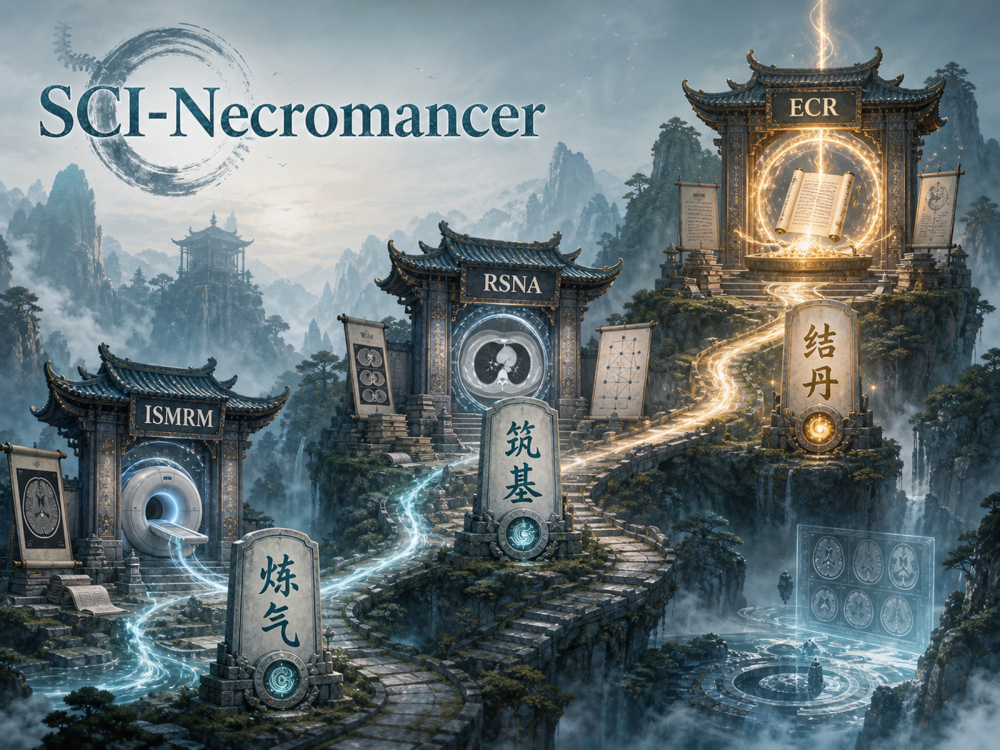
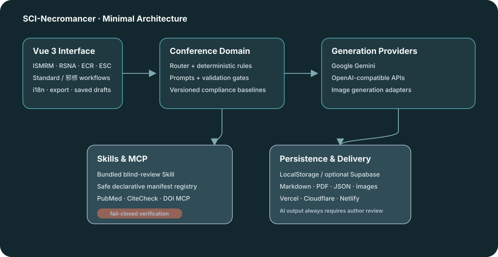

<div align="center">
  <a href="https://www.rad-sci.org/" target="_blank"></a>

  <p><a href="README.md">English</a> · <a href="README_CN.md">中文</a> · <a href="README_DE.md">Deutsch</a></p>
  <p>
    <a href="https://github.com/picspin/Sci-Necromancer/actions/workflows/ci.yml"></a>
    <a href="https://vite.dev/"></a>
    <a href="LICENSE"></a>
    <a href="https://github.com/picspin/Sci-Necromancer"></a>
    <a href="#部署"></a>
  </p>
</div>

[](https://www.rad-sci.org/)

## 全局概览

SCI-邪修是面向医学影像与心血管会议摘要的开源 AI 辅助工具。它通过标准分析或更具探索性的 **邪修/炼丹模式**，将研究材料组织为 ISMRM、RSNA、ECR/ER 与 ESC 摘要草稿。

系统可以辅助分析、润色、排版、配图、导出和独立盲审，但**不能保证**数据、伦理审批、患者脱敏、统计结果、引文或投稿合规真实准确。作者必须承担最终核验与投稿责任。

## 架构



Vue 3 提供统一界面与会议 slice；确定性会议规则约束模型提示并检查输出；可选 Skills & MCP 层提供内置只读盲审 Skill、会员专属 MGA 科研核验 Agent，以及白名单限定的 PubMed、Semantic Scholar、Hubble 摘要检索、CiteCheck 和 DOI 验证。默认使用本地存储，可选接入 Supabase。

## 功能

- 标准流程：原始材料 → 分析 → 类型/分类确认 → 生成 → 保存/导出。
- 邪修模式统一使用“一键炼丹”完成研究想法扩展。
- 支持 ISMRM、RSNA science/education、ECR/ER 与 ESC。
- 完整中英文界面、错误提示和无障碍标签切换。
- 图像生成/编辑，以及 Markdown、PDF、JSON 和图像导出。
- 9 类期刊风格模板与 7 类可解释 schematic 布局，并允许用户覆盖自动推荐。
- 可选会员服务：GitHub 登录、注册 5 bonus、每日签到、托管 Gemini/GPT Image、Stripe 充值和显式 Supabase 私有保存。
- 托管标准“分析→生成”一次任务扣 1 bonus；重生成、深度更新或单张生图各扣 1。BYOK 不消耗平台 bonus。
- Skills 与 MCP 独立开关、安全本地 JSON 清单导入、盲审 Skill 下载。
- 从伦理、同意、脱敏、数据、方法、引文、报告规范和会议规则进行结构化盲审。
- 外部证据服务严格 fail-closed：不可用绝不等同于已核验。

## 快速开始

需要 Node.js 18+，以及 Google Gemini 或 OpenAI 兼容 API 密钥。

```bash
git clone https://github.com/picspin/Sci-Necromancer.git
cd Sci-Necromancer
npm install
npm run dev
```

打开 Vite 输出的本地地址，并在“模型配置”中设置供应商。

## 使用

1. 选择 ISMRM、RSNA、ECR/ER 或 ESC。
2. 粘贴/上传原始材料，或切换邪修模式输入核心构想。
3. 分析并确认投稿路径，然后生成摘要。
4. 保存、导出，或执行独立盲审。
5. 投稿前逐项核验事实、伦理、隐私、统计、引文与最新会议规则。

“Skills & MCP”允许分别加载 Skills 和 MCP。外部 `.json` 只能激活部署中已内置并受信任的指定适配器；未绑定适配器的清单仅登记。浏览器会忽略命令和凭据，新增可执行 MCP 适配器仍须由后端管理员部署。

## 部署

```bash
npm run test -- --run
npm run lint
npm run build
```

可将 `dist/` 部署至 Cloudflare、Vercel 或 Netlify，并配置 SPA 回退到 `index.html`；`api/` 单独部署到 Vercel，[vercel.json](vercel.json) 将 Functions 固定在美国 `iad1`。按 [.env.example](.env.example) 配置 Supabase、Turnstile、模型供应商和 Stripe 服务端密钥，再通过 `VITE_API_BASE_URL` 让各静态站点连接该后端，并执行 `supabase/migrations/` 下两份 SQL。服务端凭据不得写入 `VITE_*`；海外节点也不得用于绕过供应商地区限制或条款。

Stripe webhook 地址设为 `/api/stripe-webhook`，API 版本固定为 `2026-02-25.clover`，并显式订阅 `checkout.session.completed`、`refund.created`、`refund.updated`、`charge.dispute.created` 和需单独选择的 `charge.dispute.funds_reinstated`。上线真实支付前，须用 Stripe CLI 测试购买、成功退款、重复投递、争议和争议资金恢复。

CiteCheck/DOI MCP 的 HTTPS facade 与可信边缘令牌配置见[后端指南](docs/BLIND_REVIEW_BACKEND.md)。

## 参考资料

- [RSNA 摘要投稿](https://www.rsna.org/annual-meeting/abstract-submission)
- [RSNA 讲者资源](https://www.rsna.org/annual-meeting/attendee-resources/faculty-and-presenter-resources)
- [ISMRM 投稿指南](https://www.ismrm.org/26m/call/submission-guide/)
- [ECR 摘要投稿](https://www.myesr.org/congress/submit/abstract-submission/)
- [ESC 摘要规则](https://www.escardio.org/events/congresses/esc-congress/call-for-science/abstracts/rules/)
- [STARD](https://www.equator-network.org/reporting-guidelines/stard/) · [TRIPOD](https://www.tripod-statement.org/)

官方规则会变化；内部资料只用于辅助起草，投稿前必须以当年官方网站为准。

## 故障排查

- **空白页：** 使用 Node 18+，重新安装依赖并查看浏览器控制台。
- **模型报错：** 检查密钥、Base URL、模型名、额度与供应商隐私条款。
- **文件提取失败：** 改为粘贴纯文本，或先处理扫描/加密文件。
- **外部审核器不可用：** 检查复选框、后端 facade、HTTPS、超时和可信边缘请求头。
- **输出异常：** 清除流程，从已核实材料重新生成；不要提交未经人工复核的 AI 文本。

项目采用 MIT 许可证，欢迎贡献与基于证据的修正。
