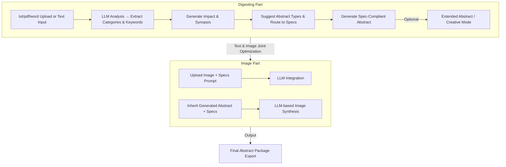

# Abstract Generation Workflow

## Overview

This document describes the complete workflow for generating academic abstracts using the Sci-Necromancer system.

## Workflow Architecture



## Detailed Workflow Steps

### Step 1: Content Analysis (A1 → A2)

**Input:** Raw text from uploaded file or direct input

**Process:**
- Parse and extract text content
- Send to LLM for analysis
- Extract categories and keywords using ISMRM category routing table

**Output:**
```typescript
{
  categories: [
    { name: "Neuro", type: "main", probability: 0.85 },
    { name: "fMRI", type: "sub", probability: 0.75 },
    ...
  ],
  keywords: ["diffusion", "brain", "connectivity", ...]
}
```

**UI Features:**
- Loading animation with emojis (🔍 Analyzing... 📊 Extracting categories... 🔑 Finding keywords...)
- Progress indicator
- Responsive feedback

### Step 2: Generate Impact & Synopsis (A2 → A3)

**Input:** 
- Original text
- Selected categories
- Selected keywords

**Process:**
- Generate 40-word Impact statement
- Generate 100-word Synopsis (Motivation, Goals, Approach, Results)
- Use humanization guidelines to avoid AI-like phrasing

**Output:**
```typescript
{
  impact: "This study demonstrates...",
  synopsis: "Motivation: ... Goals: ... Approach: ... Results: ..."
}
```

**UI Features:**
- Interactive category/keyword selection with probability badges
- Auto-fill selected items into main panel
- Micro-interactions on button press
- Real-time word count display

### Step 3: Abstract Type Suggestion (A3 → A4)

**Input:**
- Text snippet
- Selected categories
- Selected keywords

**Process:**
- Route through guideline router
- Match to appropriate abstract types:
  - **Standard Abstract**: Technical/methods-focused research
  - **Registered Abstract**: Hypothesis-driven, pre-registration
  - **MRI in Clinical Practice**: Clinical application focus
  - **ISMRT Abstract**: Technologist-focused work

**Output:**
```typescript
[
  { type: "Standard Abstract", probability: 0.75 },
  { type: "MRI in Clinical Practice Abstract", probability: 0.45 },
  ...
]
```

**UI Features:**
- Responsive pop-up showing probable types
- Probability visualization (progress bars or badges)
- Type selection interface
- Guidance preview for each type

### Step 4: Generate Spec-Compliant Abstract (A4 → A5)

**Input:**
- Original text
- Generated Impact & Synopsis
- Selected abstract type
- Categories & keywords

**Process:**
- Load type-specific guidance from `/public/` directory:
  - `standard abstract guidance.md`
  - `registered abstract guidance.md`
  - `mri in clinical practice abstract guidance.md`
  - `ISMRT abstract.md`
- Apply spec-specific prompts
- Generate structured abstract following format requirements

**Output:**
```typescript
{
  abstract: "INTRODUCTION: ... METHODS: ... RESULTS: ... DISCUSSION: ... CONCLUSION: ...",
  impact: "...",
  synopsis: "...",
  keywords: [...]
}
```

**Type-Specific Structures:**

#### Standard Abstract
- INTRODUCTION
- METHODS
- RESULTS
- DISCUSSION
- CONCLUSION
- Word limit: 750 words

#### Registered Abstract
- INTRODUCTION
- HYPOTHESIS (explicit, testable)
- METHODS (future tense)
- STATISTICAL METHODS
- Word limit: 500 words

#### MRI in Clinical Practice
- BACKGROUND
- TEACHING POINT
- DIAGNOSIS AND TREATMENT
- SIGNIFICANCE
- KEY POINTS (at least 3)
- Word limit: 750 words

#### ISMRT Abstract
- Clinical Practice Focus OR Research Focus
- Technologist-oriented language
- Practical application emphasis

### Step 5: Creative Mode (A5 → A6)

**Input:** Core idea (one sentence)

**Process:**
- Expand core idea into full abstract
- Invent plausible scientific details
- Generate Impact, Synopsis, and Keywords
- Follow selected abstract type structure

**Output:** Complete AbstractData with all sections

## Implementation Files

### Core Files

1. **`lib/llm/prompts/ismrmPrompts.ts`**
   - Analysis prompt (Step 1)
   - Abstract type suggestion prompt (Step 3)
   - Legacy prompts for backward compatibility

2. **`lib/llm/prompts/abstractSpecPrompts.ts`** ✨ NEW
   - Impact & Synopsis generation prompt (Step 2)
   - Type-specific abstract generation prompts (Step 4)
   - Creative mode prompts (Step 5)

3. **`lib/llm/workflowService.ts`** ✨ NEW
   - Complete workflow orchestration
   - Step-by-step execution
   - Progress callbacks for UI updates

4. **`lib/llm/enhancedLlmService.ts`**
   - Provider management (Google AI / OpenAI)
   - Retry and fallback logic
   - Offline mode handling

### Guidance Files (in `/public/`)

- `standard abstract guidance.md`
- `registered abstract guidance.md`
- `mri in clinical practice abstract guidance.md`
- `ISMRT abstract.md`
- `ismrm abstract categories & keywords.md`
- `abstract category guidance.md`
- `call for abstracts global guidance.md`

## Usage Examples

### Basic Workflow

```typescript
import { WorkflowService } from './lib/llm/workflowService';

const workflow = new WorkflowService('google', apiKey);

// Complete workflow with progress tracking
const result = await workflow.completeWorkflow(
  inputText,
  'Standard Abstract', // optional, will auto-suggest if not provided
  (step, data) => {
    console.log(`Progress: ${step}`, data);
    // Update UI here
  }
);

console.log(result.finalAbstract);
```

### Step-by-Step Workflow

```typescript
// Step 1: Analyze
const analysis = await workflow.analyzeContent(text);

// Step 2: Generate Impact & Synopsis
const { impact, synopsis } = await workflow.generateImpactSynopsis(
  text,
  analysis.categories,
  analysis.keywords
);

// Step 3: Get suggestions
const suggestions = await workflow.suggestAbstractTypes(
  text,
  analysis.categories,
  analysis.keywords
);

// Step 4: Generate final abstract
const abstract = await workflow.generateAbstractByType(
  text,
  impact,
  synopsis,
  'Standard Abstract',
  analysis.categories,
  analysis.keywords
);
```

### Creative Mode

```typescript
const creativeAbstract = await workflow.generateCreativeAbstract(
  "Novel deep learning method for accelerated MRI reconstruction",
  'Standard Abstract'
);
```

## UI/UX Enhancements Needed

### Step 2 (Impact & Synopsis Generation)
- [ ] Add button with micro-interactive effect
- [ ] Show loading progress with emojis: 🔍 → 📝 → ✨
- [ ] Display text analysis progress
- [ ] Reduce black-box perception with intermediate outputs

### Step 3 (Category & Keyword Selection)
- [ ] Responsive pop-up for category selection
- [ ] Probability badges (e.g., "85% Neuro", "75% fMRI")
- [ ] Keyword chips with selection state
- [ ] Auto-fill selected items into main panel
- [ ] Sort by probability (highest first)

### Step 4 (Abstract Type Selection)
- [ ] Type suggestion cards with probability
- [ ] Preview of type requirements on hover
- [ ] Guidance snippet display
- [ ] Confirmation before generation

### Step 5 (Abstract Generation)
- [ ] Generate button with loading state
- [ ] Progress indicator for long operations
- [ ] Preview panel for generated abstract
- [ ] Edit and regenerate options

## Error Handling

The workflow includes comprehensive error handling:

1. **Network Errors**: Automatic retry with exponential backoff
2. **Provider Fallback**: Switch from primary to fallback provider
3. **Offline Mode**: Graceful degradation with basic functionality
4. **Validation**: Input validation at each step
5. **User Feedback**: Clear error messages with recovery actions

## Testing

Test each workflow step independently:

```typescript
// Test analysis
const analysis = await workflow.analyzeContent(sampleText);
expect(analysis.categories).toBeDefined();
expect(analysis.keywords.length).toBeGreaterThan(0);

// Test impact/synopsis generation
const { impact, synopsis } = await workflow.generateImpactSynopsis(
  sampleText,
  analysis.categories,
  analysis.keywords
);
expect(impact.split(' ').length).toBeLessThanOrEqual(40);
expect(synopsis.split(' ').length).toBeLessThanOrEqual(100);

// Test abstract generation
const abstract = await workflow.generateAbstractByType(
  sampleText,
  impact,
  synopsis,
  'Standard Abstract',
  analysis.categories,
  analysis.keywords
);
expect(abstract.abstract).toContain('INTRODUCTION');
expect(abstract.abstract).toContain('METHODS');
```

## Future Enhancements

1. **Multi-language Support**: Extend to non-English abstracts
2. **Conference-Specific Routing**: RSNA, JACC, etc.
3. **Collaborative Editing**: Real-time co-authoring
4. **Version History**: Track abstract iterations
5. **AI Suggestions**: Inline improvement suggestions
6. **Citation Management**: Automatic reference formatting
7. **Figure Integration**: Link figures to abstract sections
8. **Export Templates**: Conference-specific formatting

## Notes

- **Impact ≠ Abstract**: Impact is a 40-word statement, not the full abstract
- **Synopsis ≠ Abstract**: Synopsis is a 100-word summary, not the full abstract
- **Abstract**: The full structured document following type-specific guidelines
- All word limits are strictly enforced
- Humanization guidelines are critical to avoid AI-like phrasing
- Each abstract type has unique structure and requirements
